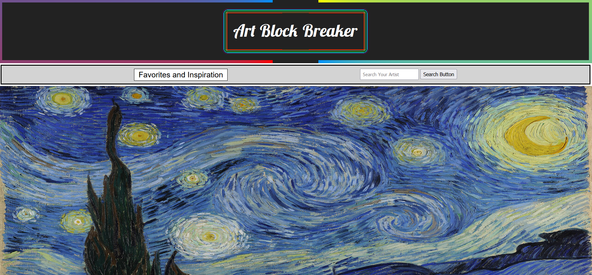
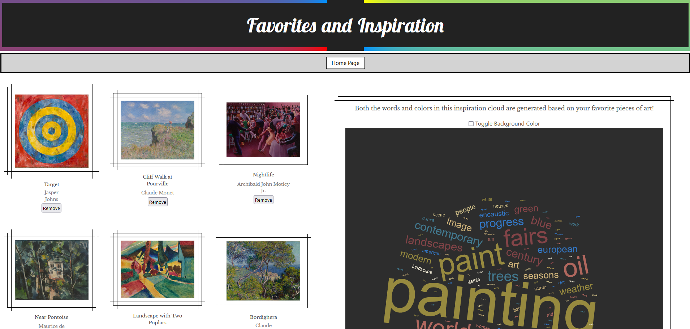

# Art Block Breaker

## Team Members

Hailong (David) - [ChgDave](https://github.com/ChgDave)

Archer - [flying-tadpole](https://github.com/flying-tadpole)

Travis - [Tavisnator](https://github.com/Tavisnator)

## Description

This was created for a coding bootcamp - Project 1.

The prompt was to create an application that used at least two APIs, incorporated user input, and saved information to local storage.

We chose to create an art exploration and idea generation tool. By using APIs from the Art Institute, the user is able to discover pieces of art they enjoy and save specific pieces to a favorites list. The user is then able to generate a word cloud using a word cloud generator API to provide inspiration for their own art.

## Installation

[Github Repo link.](https://github.com/Coding-Bootcamp-Project-1/ArtBlockBreaker)

[Github Pages link.](https://coding-bootcamp-project-1.github.io/ArtBlockBreaker/)

Preview:

## Credits

Used code snippets provided as a part of coding bootcamp.

[Art Institute API](https://api.artic.edu/docs/#introduction)

[Color Convertor API](https://www.thecolorapi.com/)

[Word Cloud Generator API](https://quickchart.io/documentation/word-cloud-api/#getting-started)

[Image frame styling](https://freefrontend.com/css-frames/)

[Bulma modal styling](https://bulma.io/documentation/components/modal/)